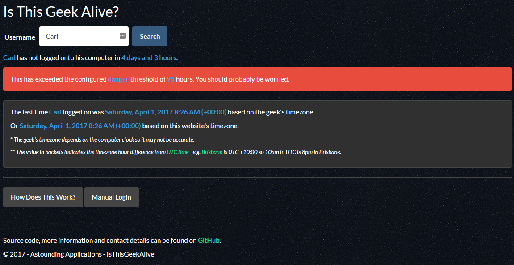

# Is This Geek Alive

## Website

The website is built using .NET Core 1.0. It is currently hosted on Microsoft Azure at http://isthisgeekalive.azurewebsites.net/. 

It can, of course, be hosted somewhere else by anyone with a copy the source code. 

## Monitor

The monitor application is built using .NET Framework 4.5.2 and Windows Presentation Framework (WPF). 

The latest installer can be found [here](IsThisGeekAliveMonitor/InnoSetup/Output/IsThisGeekAliveMonitorSetup.exe). Click the Download button to download the file to your PC.

##

To contact me, you can find my email address on my github profile https://github.com/notsonormal.
